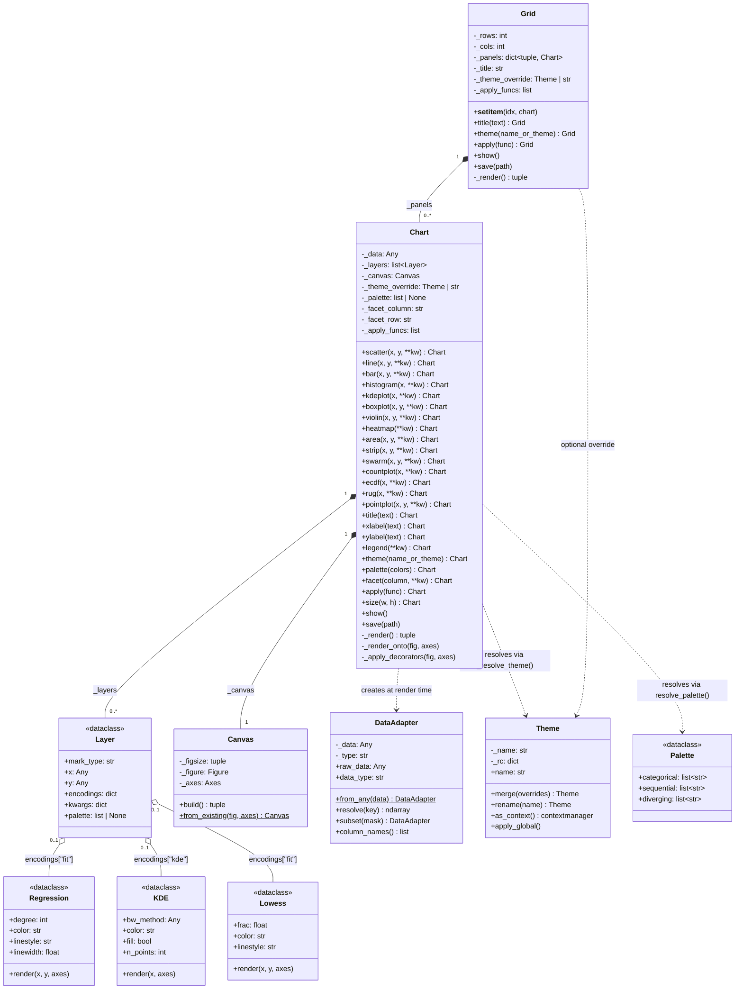
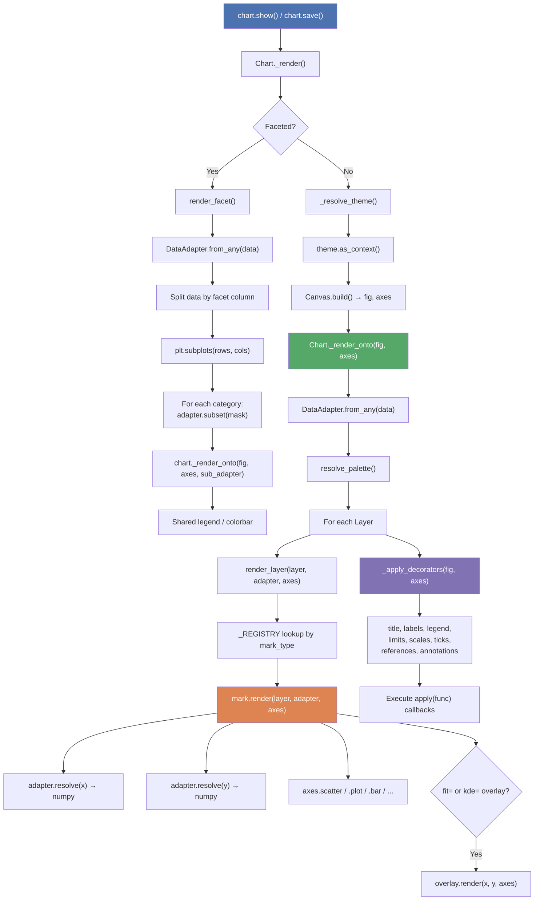
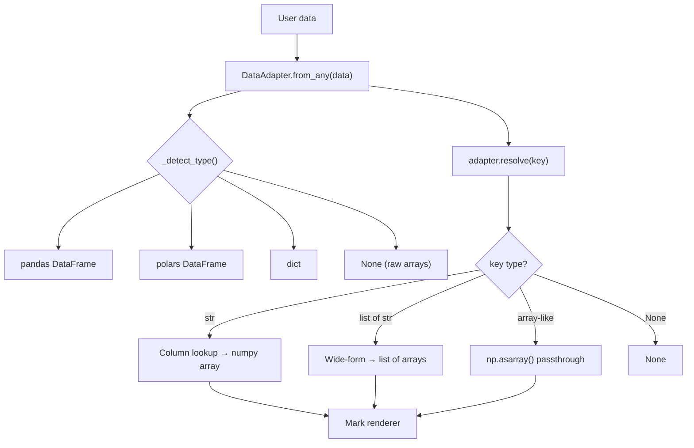
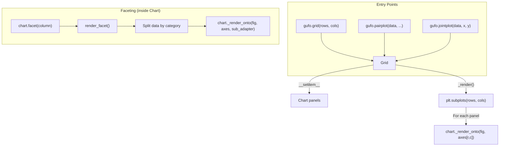
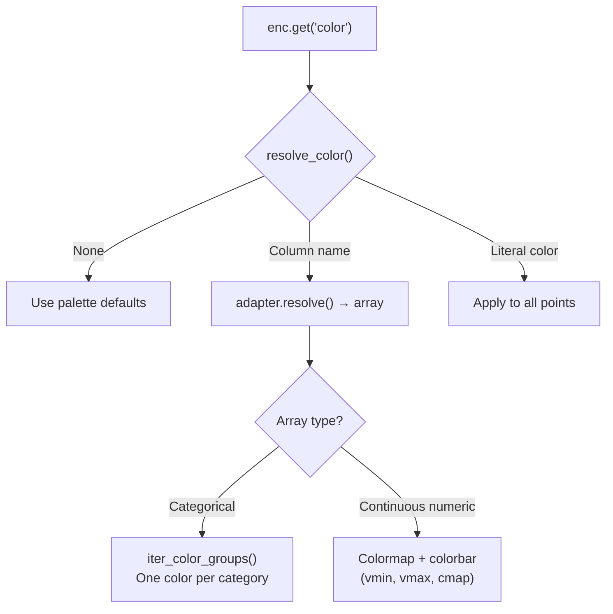

# Architecture

This page describes how Gufo's internal classes interact — the composition
relationships, rendering pipeline, and data flow.

## Class Diagram

## Rendering Pipeline

## Data Flow

`DataAdapter` is the single resolution point for all input types. Marks never
receive raw DataFrames — they always go through `adapter.resolve(key)`.

## Layout Relationships

## Color Resolution

